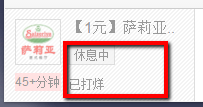

# 我认为可以修改的地方
## 体验方面
#### 1. 页面中的主要的内容模块逻辑上不清晰

第一个模块是“我的收藏”，第二个模块其实想要呈现的是“品牌馆”。

"我的收藏"，“附近团购”等是名词，用以分类；“前往品牌馆”和“查看56家品牌餐厅”是动作，用以引导用户，但是在页面上逻辑上确实相同的。而且“前往品牌馆”，“查看56家品牌餐厅”，两者的链接是相同的。


#### 2. 店铺信息的呈现

个人认为很不友好，当信息过很长时，容易出现这种情况 

  

这些信息可以在店铺的详情页面中呈现。

## 代码方面
#### 1. HTML结构不合理
* **单个的店铺**  
    目前的结构是这样分的:  

    ,
    
    ```html
    <div class="line-one">
        <div class="logo-wrapper"> 
        <div class="info">
    ```

    在“logo-wrapper”中包含了送货时间；info里面包含了送货和交易等信息，这个info是店铺的info还是交易的info呢？我认为此处可以改成：  

    

* **CSS Sprite 有效问题**  
    global 下的 bg.gif 中的 stars，最好的方法是不同等级按精确的等差数值排列，方便使用 CSS预处理器编写：

    ```scss
    .rating-stars{
        display: inline-block;
        width: 61px;
        height: 14px;
        background: url(../../images/global/bg.gif) no-repeat -1px -193px;
        @for $i from 0 through 10{
            &.r#{$i}{
                background-position:-1px -333px+($i * 15);
            }
        }
    }
    ```

    但是现在给出的Sprite图，那些小星星在最后两个上位置出现了问题

* **单选就用radio**  
过滤店铺时，提供的是单项选择，不应该是用 `checkbox` ，应该使用 `radio`。  
    

* **两端对齐**  
    
    这个部分写死了，margin是固定的值。。可以使用 `text-align:justify` 
    参考：[列表的两端对齐布局](http://www.zhangxinxu.com/wordpress/2011/03/displayinline-blocktext-alignjustify%E4%B8%8B%E5%88%97%E8%A1%A8%E7%9A%84%E4%B8%A4%E7%AB%AF%E5%AF%B9%E9%BD%90%E5%B8%83%E5%B1%80/)

## 其他的问题

1. 页面中每一个面板中的内容都是table，不太灵活
2. 页面不是响应式
3. 导航可以添加鼠标hover
4. 这两个似乎没什么区别 ,写页面的时候我很纠结……  
    


