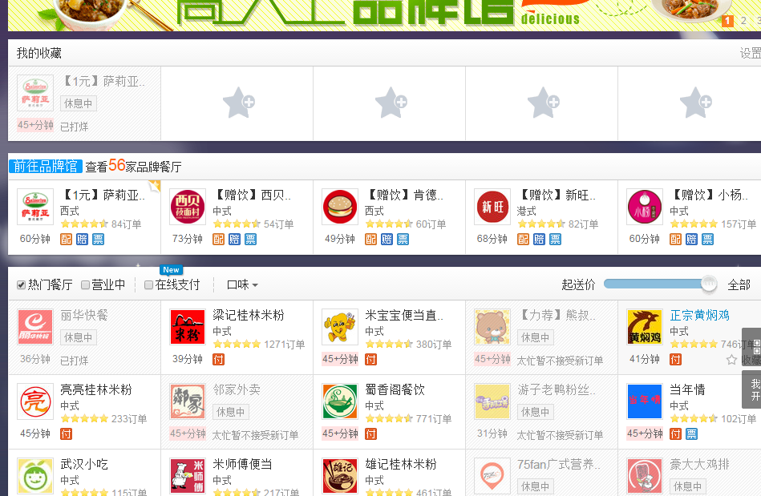
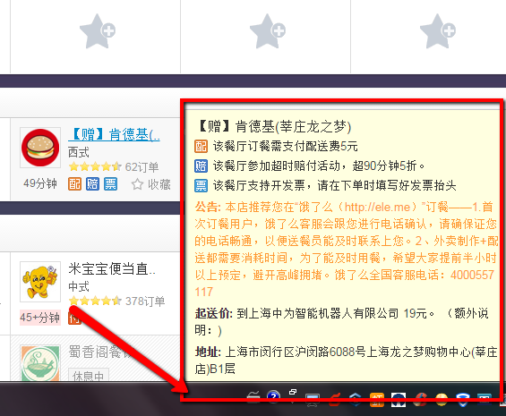
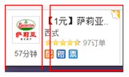
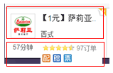
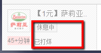

# 我认为可以修改的地方
## 体验方面
#### 1. 页面中的主要的内容模块逻辑上不清晰

第一个模块是“我的收藏”，第二个模块其实想要呈现的是“品牌馆”。

"我的收藏"，“附近团购”等是名词，用以分类；“前往品牌馆”和“查看56家品牌餐厅”是动作，用以引导用户，但是在页面上逻辑上确实相同的。而且“前往品牌馆”，“查看56家品牌餐厅”，两者的链接是相同的。




#### 2. 店铺信息的呈现

个人认为很不友好，当信息过很长时，容易出现这种情况 

  

这些信息可以在店铺的详情页面中呈现。

## 代码方面
#### 1. HTML结构不合理
* 单个的店铺
    目前的结构是这样分的:  

    ,
    
    ```html
    <div class="line-one">
        <div class="logo-wrapper"> 
        <div class="info">
    ```

    在“logo-wrapper”中包含了送货时间；info里面包含了送货和交易等信息，这个info是店铺的info还是交易的info呢？我认为此处可以改成：  

    


## 其他的问题

1. 页面中每一个面板中的内容都是table，不太灵活
2. 页面不是响应式
3. 导航可以添加鼠标hover
4. 这两个似乎没什么区别 ,写页面的时候我很纠结……
    


###TODO:

1. header中搜索框的交互
2. header中，点击用户名出现下拉菜单的交互
3. header中，购物篮和消息图片 hover样式
4. 
